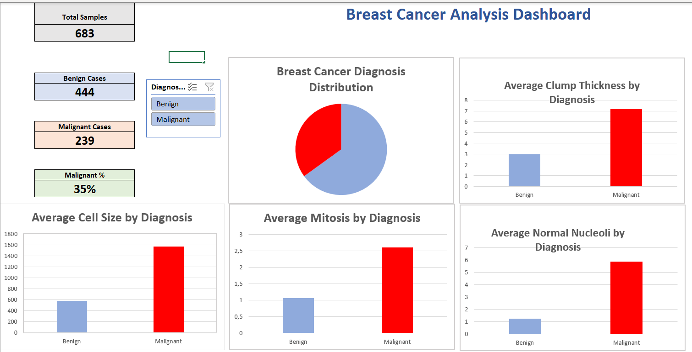
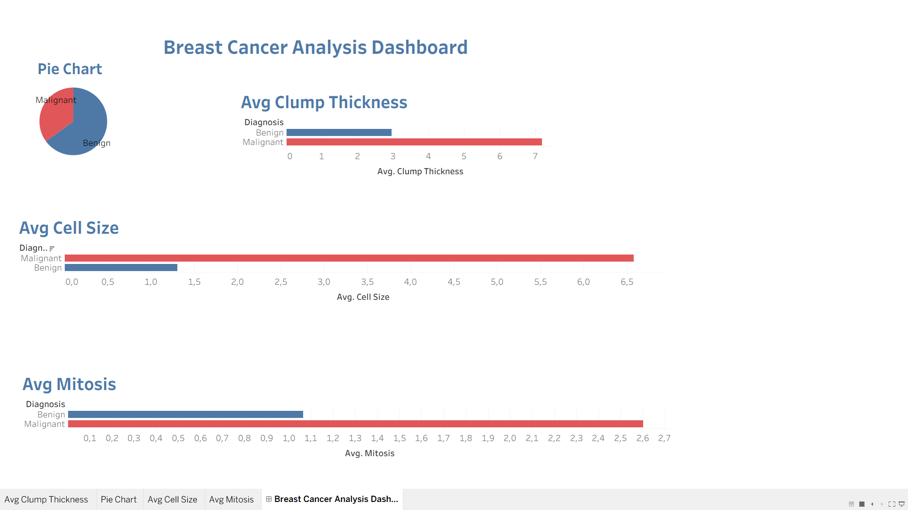

# Breast Cancer Analysis

## Project Overview
This project analyzes the Wisconsin Breast Cancer Dataset using Python, Excel, and Tableau.

The objective is to explore the dataset, identify patterns between benign and malignant tumors, and present the results through interactive dashboards and visualizations.

## Tools Used
- Python
- Pandas
- NumPy
- Matplotlib
- Excel
- Tableau

## Dataset
Dataset: Wisconsin Breast Cancer Dataset

The dataset contains diagnostic measurements extracted from breast cancer cell images and is commonly used for classification and data analysis tasks.

## Project Workflow
1. Data collection and inspection
2. Data cleaning and preprocessing
3. Exploratory Data Analysis (EDA)
4. Dashboard creation in Excel
5. Dashboard creation in Tableau
6. Visualization and interpretation of findings

## Excel Dashboard



## Tableau Dashboard



## Key Findings
- Benign cases represent the majority of the dataset.
- Malignant tumors generally show higher values in several diagnostic features.
- Visual dashboards provide a clear comparison between diagnostic categories.

## Repository Structure

```
Breast-Cancer-Analysis/
│
├── analysis.py
├── breast-cancer-wisconsin.xlsx
├── cleaned_breast_cancer.csv
├── dashboard.xlsx
├── Breast Cancer Analysis Dashboard.twbx
├── Excel_Dashboard.png
├── Tableau_Dashboard.png
└── README.md
```

## Author
Youssef Hesham Mohamed  
Bioinformatics Student – Port Said University
